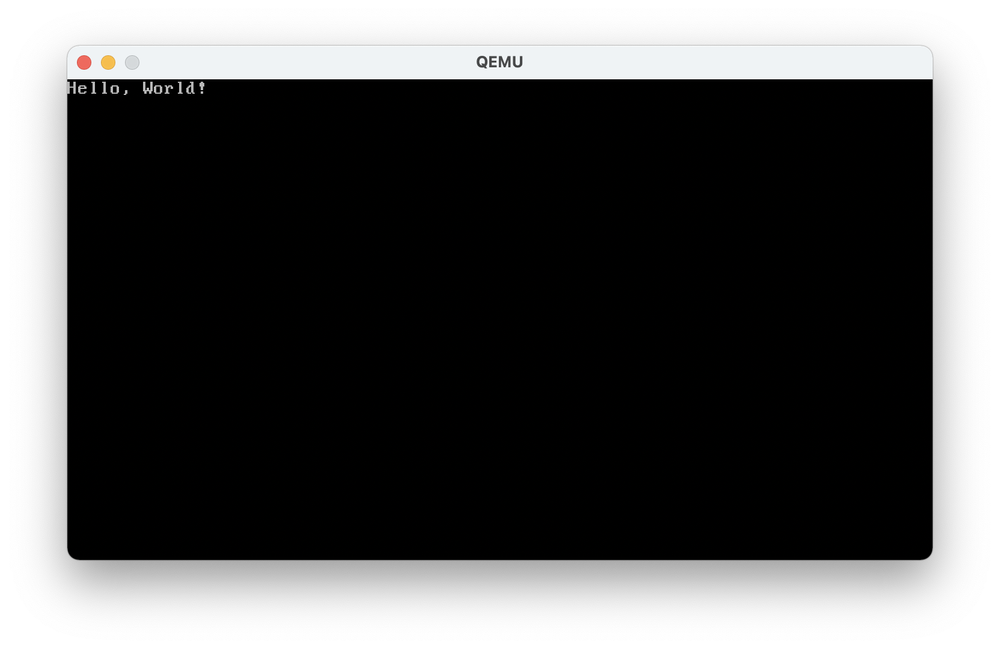

# VBVLLGD
Very Basic, Very Low Level Graphics Driver

VBVLLGD is a very basic and very low level graphics *driver* for 16-bit real mode Assembly. 

It prints strings and clears the screen using BIOS interrupts, therefore it requires 16-bit real mode. 

## License
[MIT License](LICENSE.md)

